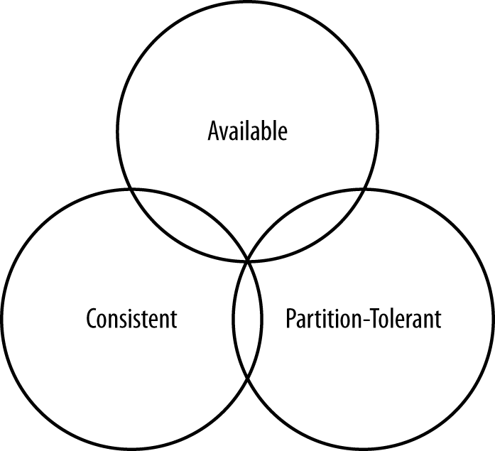
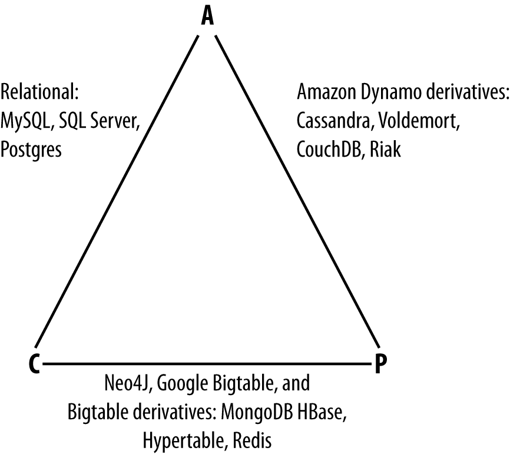

The theorem states that within a large-scale distributed data system, there are three requirements that have a relationship of sliding dependency:

#### Consistency
All database clients will read the same value for the same query, even given concurrent updates.

#### Availability
All database clients will always be able to read and write data.

#### Partition tolerance
The database can be split into multiple machines; it can continue functioning in the face of network segmentation breaks.

Brewer’s theorem is that in any given system, you can strongly support only two of the three. This is analogous to the saying you may have heard in software development: “You can have it good, you can have it fast, you can have it cheap: pick two.”

We have to choose between them because of this sliding mutual dependency. The more consistency you demand from your system, for example, the less partition-tolerant you’re likely to be able to make it, unless you make some concessions around availability.

The CAP theorem was formally proved to be true by Seth Gilbert and Nancy Lynch of MIT in 2002. In distributed systems, however, it is very likely that you will have network partitioning, and that at some point, machines will fail and cause others to become unreachable. Networking issues such as packet loss or high latency are nearly inevitable and have the potential to cause temporary partitions. This leads us to the conclusion that a distributed system must do its best to continue operating in the face of network partitions (to be partition tolerant), leaving us with only two real options to compromise on: availability and consistency.

Note that placement of the databases in this chart could change based on configuration. As Stu Hood points out, a distributed MySQL database can count as a consistent system only if you’re using Google’s synchronous replication patches; otherwise, it can only be available and partition tolerant (AP).

It’s interesting to note that the design of the system around CAP placement is independent of the orientation of the data storage mechanism; for example, the CP edge is populated by graph databases and document-oriented databases alike.

In this depiction, relational databases are on the line between consistency and availability, which means that they can fail in the event of a network failure (including a cable breaking). This is typically achieved by defining a single master server, which could itself go down, or an array of servers that simply don’t have sufficient mechanisms built in to continue functioning in the case of network partitions.

***Graph databases such as Neo4J and the set of databases derived at least in part from the design of Google’s Bigtable database (such as MongoDB, HBase, Hypertable, and Redis) all are focused slightly less on availability and more on ensuring consistency and partition tolerance.***

Finally, the ***databases derived from Amazon’s Dynamo design*** include ***Cassandra, Project Voldemort, CouchDB, and Riak. These are more focused on availability and partition tolerance***. However, this does not mean that they dismiss consistency as unimportant, any more than Bigtable dismisses availability. According to the Bigtable paper, the average percentage of server hours that “some data” was unavailable is 0.0047% (section 4), so this is relative, as we’re talking about very robust systems already. If you think of each of these letters (C, A, P) as knobs you can tune to arrive at the system you want, Dynamo derivatives are intended for employment in the many use cases where “eventual consistency” is tolerable and where “eventual” is a matter of milliseconds, read repairs mean that reads will return consistent values, and you can achieve strong consistency if you want to.

So what does it mean in practical terms to support only two of the three facets of CAP?

### CA

To primarily support consistency and availability means that you’re likely using two-phase commit for distributed transactions. It means that the system will block when a network partition occurs, so it may be that your system is limited to a single data center cluster in an attempt to mitigate this. If your application needs only this level of scale, this is easy to manage and allows you to rely on familiar, simple structures.

### CP
To primarily support consistency and partition tolerance, you may try to advance your architecture by setting up data shards in order to scale. Your data will be consistent, but you still run the risk of some data becoming unavailable if nodes fail.

### AP
To primarily support availability and partition tolerance, your system may return inaccurate data, but the system will always be available, even in the face of network partitioning. DNS is perhaps the most popular example of a system that is massively scalable, highly available, and partition tolerant.

